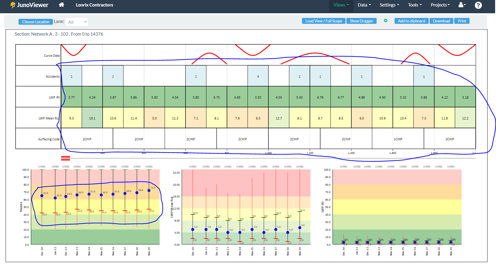

# README #

### About the repository ###
* This repository contains BDD (Behaviour Driven Development) UI test automation R&D work for LONRIX website.

### Project scope ###
* BDD framework implementation
* BDD dependency injection
* Passing data through Cucumber Feature
* Passing data through Cucumber DataTable
* Command-line execution capability
* Properties file configuration
* Environment configuration through command-line
* Logging

### Further/future plan ###
* Page Object Model implementation
* Clean duplicate code
* Selenium objects centralization
* Logging
* Exception handling
* Java Docs
* TestNG based runner class
* Project design/architecture diagram

### Test scripts scope ###
* JunoViewer > Views > Strip Map View > SVG handling at UI level. There is no implementation to handle business logics/rules.

### Prerequisite for execution ###
* Java (Java 8 or Plus) installed
* Maven installed
* JAVA_HOME environment variable configured
* MAVEN_HOME environment variable configured
* Google Chrome web browser installed

### Prerequisite for development ###
* Java (Java 8 or Plus) installed
* Maven installed
* JAVA_HOME environment variable configured
* MAVEN_HOME environment variable configured
* Java IDE installed (IntelliJ IDEA or Eclipse)
* TestNG plugin installed in IDE
* Cucumber plugin installed in IDE
* Google Chrome web browser installed

### Technologies used ###
* Java
* TestNG
* Selenium WebDriver
* Web Driver Manager
* Cucumber

### How do I get set up ###
* Download the repository into system.
* Unzip the repository

### How to execute tests ###
* Open Command Prompt or Windows PowerShell
* Go to project directory
* Execute command to run tests with default properties file and default tag(s):
```
mvn clean verify
```
Note: Default properties file is PROD

* Execute tests on specific environment (DEV, QA, UAT, PROD):
```
mvn clean verify "-Dconfig.file=config-dev"
mvn clean verify "-Dconfig.file=config-qa"
mvn clean verify "-Dconfig.file=config-uat"
mvn clean verify "-Dconfig.file=config-prod"
```
* Execute tests on specific environment (QA, DEV, UAT, PROD) and with specific tag(s):
```
mvn clean verify "-Dconfig.file=config-dev -Dcucumber.options='-t @juno'"
mvn clean verify "-Dconfig.file=config-qa -Dcucumber.options='-t @juno'"
mvn clean verify "-Dconfig.file=config-uat -Dcucumber.options='-t @juno'"
mvn clean verify "-Dconfig.file=config-prod -Dcucumber.options='-t @juno'"
```

### UI Test Coverage ###
* Till 2020/10/23


### Who do I talk to ###
* For more information contact: Jaspal Aujla at [jsaujla1@gmail.com](mailto:jsaujla1@gmail.com)